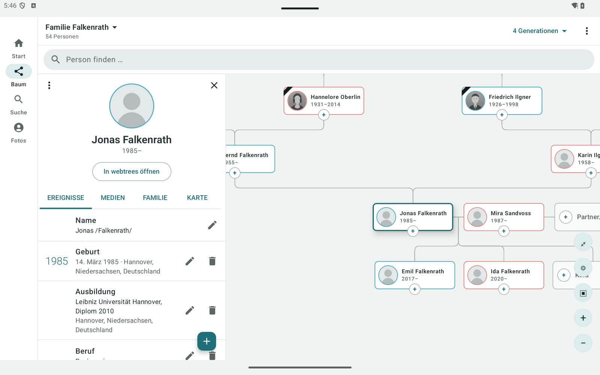
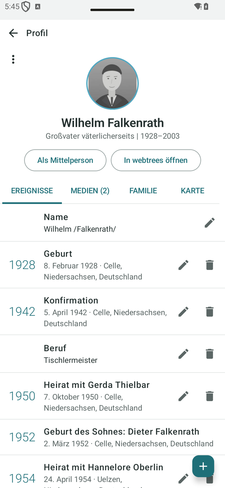
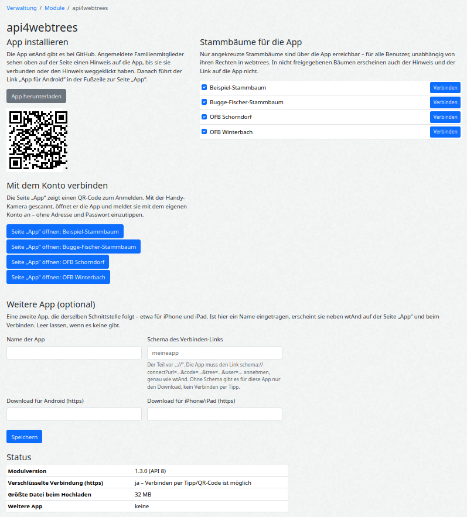

# api4webtrees

[English](README.md) · **Deutsch**

  

  
  
  

Ein Modul für [webtrees](https://webtrees.net/), das der nativen Android-App **[wtAnd](https://github.com/thobgg/app4webtrees)** eine
JSON-Schnittstelle zum Lesen **und** Schreiben gibt. Es ist ein gewöhnliches Zusatzmodul: Es liegt
in `modules_v4/`, der webtrees-Kern wird nicht verändert.

**Wozu:** Wer den Stammbaum am PC in webtrees pflegt, arbeitet weiter wie bisher. Die übrige Familie, die bisher nur
eine am Handy mühsam bedienbare Webseite hatte, bekommt den Stammbaum mit der App auf Handy und Tablet: Baum,
Verwandtschaft, Jahrestage und Fotos. Änderungen aus der App, etwa ein Foto vom Grabstein oder ein korrigiertes Datum,
landen als ausstehende Änderung in derselben webtrees-Installation.

| | |
| - | - |
| webtrees | 2.2.x (mit 2.2.6 getestet); für 2.3 vorbereitet |
| PHP | 8.3 oder neuer (wie von webtrees 2.2 verlangt) |
| Zugriff | lesen und schreiben, immer mit den Rechten des angemeldeten webtrees-Benutzers |
| Lizenz | GPL-3.0 |

## Die App: wtAnd

Das Modul ist die Server-Seite von **[wtAnd](https://github.com/thobgg/app4webtrees)**, einer nativen Android-App
(Kotlin, kein WebView) für Handy und Tablet. [APK herunterladen](https://github.com/thobgg/app4webtrees/releases/latest)
(signiert). Außerhalb des Play Store fragt Android einmalig, ob der Browser Apps installieren darf.

| Tablet: Baum und Profil nebeneinander | Handy: das Profil als Zeitleiste |
| - | - |
|  |  |

- **Baum als Mittelpunkt:** Sanduhr-Ansicht mit Ahnen, Partnern, Kindern und Enkeln, auf Wunsch mit Geschwistern;
  frei verschieben und zoomen, Zweige nach oben aufklappen, jede Person zur Mittelperson machen.
- **Profil:** Lebenslauf als Zeitleiste (mit Heirat und Geburten der Kinder), Verwandtschaft zur eigenen Person
  („Großvater väterlicherseits“), Fotos, Familie, Karte der Lebensstationen.
- **Bearbeiten:** Ereignisse anlegen, ändern, löschen, Verwandte über das „+“ an jeder Karte anlegen, Fotos aufnehmen
  oder auswählen und einer Person zuordnen; sie werden passend zum Upload-Limit des Servers verkleinert.
- **Jahrestage** der nächsten Tage, auf Wunsch mit täglicher Erinnerung; Moderatoren nehmen ausstehende Änderungen in der App an oder verwerfen sie.
- **Verbinden mit einem Tipp:** Die Seite „App“ in webtrees übergibt Server, Baum und einen Einmal-Code an die App.

Deutsch und Englisch; die Beschriftungen des Servers kommen in der Sprache der App. Was noch nicht nativ geht, öffnet
die App als webtrees-Seite in derselben Sitzung. Alle Bilder zeigen den frei erfundenen Demo-Stammbaum „Familie Falkenrath“.

## Installation

1. Das ZIP aus dem [neuesten Release](../../releases/latest) laden.
2. Nach `modules_v4/` der webtrees-Installation entpacken, sodass `modules_v4/api4webtrees/module.php` entsteht.
3. Fertig. Das Modul ist aktiv und steht unter *Verwaltung → Module → Alle Module*.

Wer von Version 1.2.0 oder älter kommt: **den alten Ordner `modules_v4/webtreesand-api` löschen**, er heißt seit 1.3.0 anders.
Damit ändert sich auch die Adresse des Moduls (`_api4webtrees_` statt `_webtreesand-api_`); wtAnd ab 1.7 kennt beide,
und das Modul übernimmt beim ersten Aufruf seine Einstellungen vom alten Namen (1.3.2).

Aktualisieren: Ordner ersetzen. Entfernen: Ordner löschen. Das Modul legt keine Datenbanktabellen an. Es
speichert eine Moduleinstellung (welche Bäume die App erreichen darf) und je Benutzer nur den Hash eines Einmal-Codes, solange er gilt.

## Einstellungen

*Verwaltung → Module → Alle Module → api4webtrees → Schraubenschlüssel* (Tipp: im Suchfeld der Modulliste „API“
eintippen). Die Seite bietet den App-Download, den Status (https, Upload-Limit) und den wichtigsten Schalter:
**welche Stammbäume die App erreichen darf.** Nicht angekreuzte Bäume sind über dieses Modul gar nicht erreichbar,
für keinen Benutzer und unabhängig von seinen Rechten in webtrees. Standard: alle Bäume.

**Apps:** die Apps, die das Modul kennt (wtAnd, wtWin, wtTux, wtMac und per Pull Request hinzugekommene), je mit Häkchen.
Abgehakte verschwinden von der Seite „App“, aus dem Hinweis und der Fußzeile. Standard: alle an. Siehe
[Apps auf der Seite „App“](#apps-auf-der-seite-app).

## Für Benutzer: die Seite „App“

Angemeldete Benutzer sehen oben auf der Seite einen Hinweis mit einem Knopf zur Seite „App“ – am Windows- oder Linux-PC
**„Den Stammbaum als Programm auf dem PC“** (wtWin/wtTux), am Handy **„Den Stammbaum aufs Handy“** (wtAnd). Handy und PC
werden getrennt gemerkt: Der Hinweis verschwindet für diese Geräteart, sobald ihre App verbunden ist (oder nach *Nicht
mehr anzeigen*); danach führen die Links in der Fußzeile dorthin. Die Seite zeigt die Apps für das Gerät des Besuchers
zuerst (eigene vor fremden), wtWin und wtAnd immer aufgeklappt, die übrigen eingeklappt darunter. Auf iPhone und iPad
sagt sie, dass es noch keine App gibt, und empfiehlt den Browser. Je App zwei Schritte:

1. **Installieren:** ein Knopf zur neuesten Datei (`.exe`, `.deb` oder APK), fürs Handy auch als QR-Code.
2. **Mit dem eigenen Konto verbinden – nichts eintippen, das Passwort erreicht das Gerät nie:**
   - **PC:** Der Knopf *Mit wtWin verbinden* legt den Verbinden-Link mit einem Einmal-Code in die Zwischenablage und
     öffnet ihn als `wtwin://connect?…` (unter Linux `wttux://`). wtWin/wtTux (ab 1.21) übernehmen ihn aus der
     Zwischenablage, solange sie auf eine Verbindung warten, oder bekommen ihn vom Browser – sie melden sich beim ersten
     Start selbst für ihr Schema an, ohne Administratorrechte. Sie fragen einmal nach, dann ist der Baum offen. Ist die
     Seite älter als der Code, lädt sie sich beim Zurückkommen selbst neu (etwa nach Download und Installation).
   - **Handy:** ein Tipp, oder am Computer ein QR-Code für die Handy-Kamera.
   - Von Hand bleibt *Adresse kopieren*: Die Programme setzen sie selbst ein, danach mit Benutzername und Passwort anmelden.

Der Einmal-Code wird nur dem angemeldeten Benutzer gezeigt, gilt 10 Minuten und genau einmal und wird nur über https
angeboten – oder über http im Heimnetz (private Adressen, `.local`, `.lan`, `.fritz.box` …), nach derselben Regel, nach
der die Apps http zulassen. Gespeichert wird nur sein Hash. Das Modul nicht unter *Verwaltung → Module → Fußzeilen*
abschalten: Das schaltet in webtrees das ganze Modul ab, samt Schnittstelle.

## Datenschutz und Rechte

Das Modul hat bewusst keine eigene Anmeldung und keine eigene Rechteverwaltung:

- Die App meldet sich mit dem normalen webtrees-Login an; jede Anfrage läuft als dieser Benutzer.
- Gelesen wird ausschließlich über die webtrees-Objekte (`canShow()`, `facts()`, `children()` …). Es
  gelten dieselben Datenschutzregeln wie auf den Webseiten: Lebende Personen erscheinen für Besucher
  als „Privat“, gesperrte Ereignisse fehlen, Bäume mit Anmeldepflicht bleiben unsichtbar.
- Geschrieben wird ausschließlich über die webtrees-eigenen Funktionen (`createFact`, `updateFact`,
  `createIndividual`, `createFamily`, `MediaFileService`). Bearbeiterrechte, `RESN locked`,
  Änderungsprotokoll und Moderation („ausstehende Änderungen“) wirken damit genau wie in der
  Weboberfläche. Jeder POST läuft durch die CSRF-Prüfung von webtrees.

Änderungen aus der App stehen **sofort in der webtrees-Datenbank**; die App hält keine eigene Kopie
der Daten. Hat der Benutzer „Änderungen automatisch annehmen“, sind sie sofort gültig; sonst warten
sie wie jede andere Bearbeitung auf die Freigabe durch einen Moderator.

## Hinter SSO oder Passwortschutz

Sitzt vor webtrees eine eigene Anmeldung (Authelia, Authentik, oauth2-proxy, Cloudflare Access, Basic-Auth), kommt die
App nicht durch; wtAnd und wtWin melden das ab der nächsten Version so. Abhilfe: im Anmeldedienst nur die Anfragen
freigeben, deren `route` `_api4webtrees_`, `media-thumbnail` oder `media-download` enthält, nicht die ganze Seite.
Dahinter schützt weiter der webtrees-Login. Die App dann über die Seite „App“ verbinden: Die Anmeldung läuft im Browser
über das SSO, die App braucht kein Passwort.

## Ein Medienordner je Stammbaum

Nutzen verschiedene Personengruppen verschiedene Bäume, sollte jeder Baum einen **eigenen Medienordner**
haben (*Verwaltung → Stammbäume → Einstellungen → Medienordner*, z. B. `media/mueller/`). Das ist eine
Eigenheit von webtrees, nicht dieses Moduls: webtrees bietet Bearbeitern alle Dateien des Medienordners an,
die der Baum noch nicht verwendet („unbenutzte Dateien“). Bei einem gemeinsamen Ordner sehen Bearbeiter des
einen Baums die Dateien des anderen und können sie verknüpfen.

## Für Entwickler

Vollständige Beschreibung aller Routen, Antwortschemas und Leistungszahlen (englisch): **[docs/API.md](docs/API.md)** (maschinenlesbar: [docs/openapi.json](docs/openapi.json), aus echten Antworten erzeugt und von den Tests geprüft).

Die vollständige Beschreibung der Schnittstelle (Adressen, Anmeldung, alle Aktionen, Fehlercodes)
steht in der [englischen README](README.md#for-developers). Was je Fassung dazukam, steht im [CHANGELOG](CHANGELOG.md);
zuletzt (1.13.0, Stufen 21–24): Orte lesen, schreiben, umbenennen und zusammenführen (Ortsdatensatz `_LOC` nach
GEDCOM-L mit GOV-Kennung, Koordinaten, Postleitzahl, Region, Land, Kurzname, Notizen, Quellen, Medien), Titel und Art
von Medienobjekten, Startperson festlegen.

**Kompatibilität:** Die Schnittstelle wächst nur. Jedes Release mit neuen Routen oder Feldern erhöht die **API-Stufe**
(`apiVersion` in `Info`, heute 19); bestehende Routen, Parameter und Felder behalten Name, Typ und Bedeutung. Ein Client
für Stufe N läuft mit jedem Modul ab Stufe N, und ein älterer Client läuft mit einem neueren Modul weiter, er sieht die
neuen Felder nur nicht. Die Tests prüfen jede Antwort gegen das dokumentierte Schema, ein Feld kann also nicht unbemerkt
verschwinden. Müsste sich je etwas unverträglich ändern, wäre es eine neue Route, nie eine geänderte.

**Apps auf der Seite „App“:** Jeder Client kann die Schnittstelle mit der normalen Anmeldung benutzen, nichts an den
JSON-Endpunkten, Rechten oder dem Datenschutz ist an eine App gebunden. Die Seiten „App“ und „Verbinden“, der Hinweis
und die Fußzeile zeigen die Apps aus `src/Apps.php`. Eine App kommt per Pull Request mit einem Eintrag dazu: Name,
Autor, Art (Handy oder PC), Geräte, Download-Adressen (https), das URL-Schema fürs Verbinden per Tipp und bei einem
Store-Link das Badge unter `resources/img`. Bedingung: Die App ist öffentlich installierbar (Store oder Release) und
nimmt den Koppel-Link an. Die Tests weisen Einträge mit fehlenden Feldern, Links ohne https oder schon vergebenem Schema
ab. Verwalter können jede App in den Einstellungen abhaken. Der Vertrag fürs Koppeln ist der von wtAnd: Die Seiten
„App“ und „Verbinden“ öffnen `<schema>://connect?url=<Basisadresse>&code=<48 Hex>&tree=<Baumname>&user=<Benutzername>`
in der App. Die App holt sich mit `GET …/Info` Sitzungs-Cookie und `csrf`, dann `POST …/Pair` mit Header `X-CSRF-TOKEN`
und Rumpf `{"code": "…"}`; Antwort `{"ok":true,"tree":"…","user":"…"}`, die Sitzung ist jetzt als dieser Benutzer
angemeldet. Für den Code gelten die Regeln [oben](#für-benutzer-die-seite-app), egal welche App ihn einlöst.

Einstieg in den Quelltext ist der Kopf von `Api4WebtreesModule.php`: dort steht, welcher Teil des Moduls in
welcher Datei unter `src/` liegt.

Releases: `./build-release.sh` baut `api4webtrees-vX.Y.Z.zip` aus dem letzten Commit.
`latest-version.txt` auf dem Hauptzweig speist den Update-Hinweis in der webtrees-Verwaltung.
