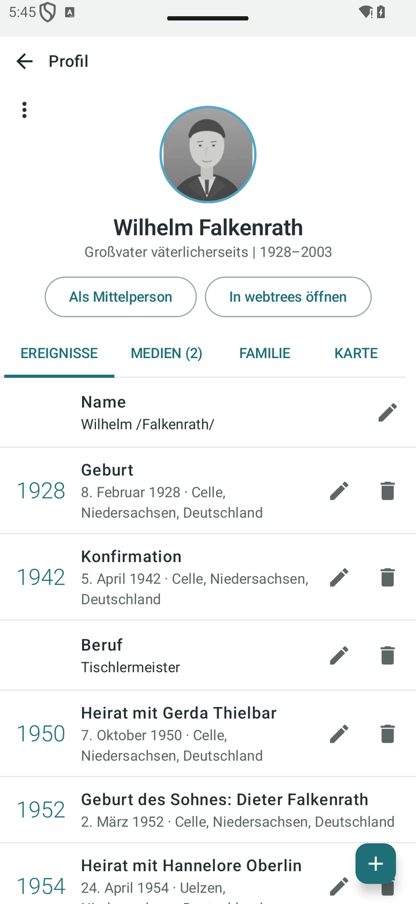
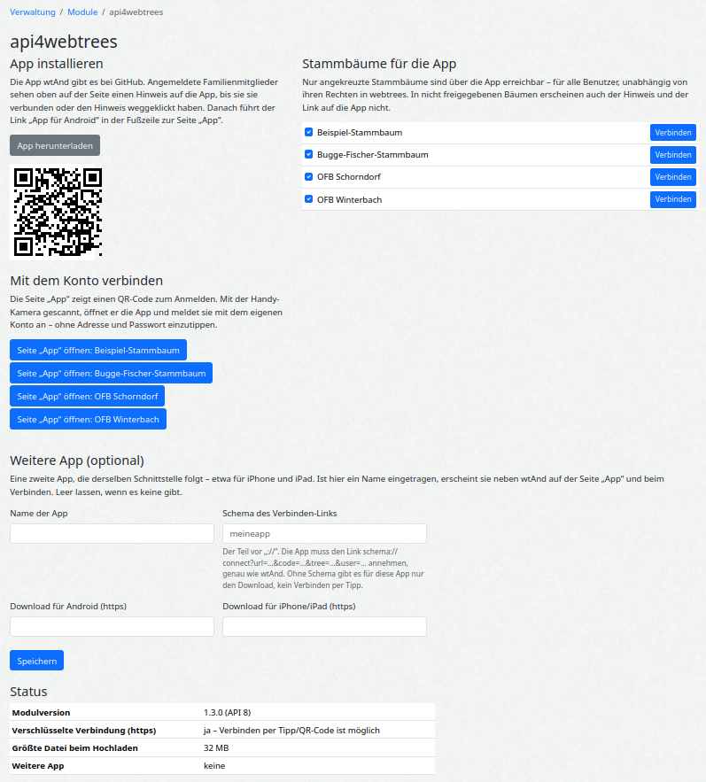

# WebtreesAnd API

**English** · [Deutsch](README.de.md)

A [webtrees](https://webtrees.net/) module that gives the native Android app **[webtreesAnd](https://github.com/thobgg/WebtreesAnd)**
a JSON interface – for reading **and** writing. It is an ordinary custom module: it lives in
`modules_v4/`, the webtrees core is not modified.

**Why:** it brings two worlds together. The person who maintains the tree meticulously at the PC keeps working in
webtrees as before. The family, who so far only got a web address that is hard to use on a phone, get the tree on phone
and tablet: who was that, how are we related, who has a birthday soon, which photos are there. And the way back is open:
the photo of a gravestone or a corrected date sent from the app arrives as a pending change for the person at the PC,
in the same installation, under the same rights and rules.

| | |
| - | - |
| webtrees | 2.2.x (tested with 2.2.6); prepared for 2.3 |
| PHP | 8.3 or newer (as required by webtrees 2.2) |
| Access | read and write – always with the rights of the signed-in webtrees user |
| License | GPL-3.0 |

## The app: webtreesAnd

The module exists for one purpose: **[webtreesAnd](https://github.com/thobgg/WebtreesAnd)**, a native Android app (Kotlin,
no WebView) for phone and tablet. Every action, every field and the one-tap connection were built for this app and are in
daily use there. [Download the APK](https://github.com/thobgg/WebtreesAnd/releases/latest) – it is signed;
outside the Play Store, Android asks once to allow your browser to install apps.

| Tablet: tree and profile side by side | Phone: the profile as a timeline |
| - | - |
|  |  |

- **The tree as the centre:** hourglass view with ancestors, partners, children and grandchildren, siblings on request;
  pan and zoom freely, unfold branches upwards, make any person the centre.
- **Profile:** life as a timeline (with marriage and the births of the children), the relationship to yourself
  (“paternal grandfather”), photos, family, a map of the places of life.
- **Editing:** add, change and delete events, add relatives with the “+” on any card, take or pick photos and attach
  them to a person – resized to fit the server's upload limit.
- **Anniversaries** of the coming days, with a daily reminder if you like; moderators accept or reject pending changes in the app.
- **Connect with one tap:** the “App” page in webtrees hands server, tree and a one-time code to the app; nothing to type.

German and English; the labels of the server come in the language of the app. Whatever is not native yet opens as a
webtrees page in the same session. All pictures show the fictional demo tree “Familie Falkenrath”.

## Installation

1. Download the ZIP from the [latest release](../../releases/latest).
2. Unpack it into `modules_v4/` of your webtrees installation, so that you get `modules_v4/webtreesand-api/module.php`.
3. Done – the module is active and listed under *Control panel → Modules → All modules*.

To update, replace the folder. To uninstall, delete it. The module creates no database tables. It stores
one module setting (which trees the app may reach) and, per user, only the hash of a pairing code while it is valid.

## Settings

*Control panel → Modules → All modules → WebtreesAnd API → wrench icon* (tip: type “API” into the search box of the
module list). The page offers the app download, the status (https, upload limit) and the most important switch:
**which family trees the app may reach.** Trees that are not ticked cannot be reached through this module at all –
for any user, whatever their rights in webtrees. Default: all trees.

**Another app (optional):** a second app that follows the same interface – for iPhone and iPad, say – can be entered
with its name, download addresses (https only) and the scheme of its connect link. It then appears next to webtreesAnd
on the “App” page and when connecting. With the fields empty nothing changes. See [Connecting other apps](#connecting-other-apps).



## For family members: the “App” page

Signed-in users find a menu entry **App**. The page offers two steps:

1. **Install the app** – a button and a QR code leading to the download.
2. **Connect your account** – one tap (or a QR code when sitting at a computer) hands the server address, the tree and
   a one-time code to the app. There is nothing to type, and the password never reaches the phone.

The one-time code is shown only to the signed-in user, is valid for 10 minutes and exactly once, and is only offered over
https. Only its hash is stored. Managers can move or hide the menu entry under *Control panel → Modules → Menus*.

## Privacy and permissions

The module has no login and no permission system of its own – on purpose:

- The app signs in with the normal webtrees login; every request runs as that user.
- Data is read only through the webtrees objects (`canShow()`, `facts()`, `children()` …). The same
  privacy rules apply as on the web pages: living individuals appear as “Private” to visitors,
  restricted facts are left out, trees that require a login stay invisible.
- Data is written only through webtrees' own functions (`createFact`, `updateFact`,
  `createIndividual`, `createFamily`, `MediaFileService`). Editor rights, `RESN locked`, the change
  log and moderation (“pending changes”) therefore work exactly as in the web interface. Every POST
  passes webtrees' CSRF check.

## One media folder per tree

If several trees are used by different groups of people, give each tree its **own media folder**
(*Control panel → Family trees → Preferences → Media folder*, e.g. `media/smith/`). This is a webtrees
matter, not one of this module: webtrees offers editors all files of the tree's media folder that the tree
does not use yet (“unused files”) – with a shared folder, editors of one tree can see and link the files
of another.

## For developers

### Addresses

The module uses webtrees' built-in module route and registers no routes of its own (the routing API
changes in webtrees 2.3, the module route does not):

```
<base>/index.php?route=<path>/module/_webtreesand-api_/<Action>[/<tree>]&<parameters>
```

`<path>` is the path part of the base URL: `/webtrees` for `https://example.org/webtrees`, empty for
an installation in the web root. webtrees expects the sub-folder **inside the `route` parameter**;
without it the answer is a 302 to the home page or a 404. With “pretty URLs” switched on, webtrees
redirects to `<base>/module/_webtreesand-api_/<Action>/<tree>?…`; the `index.php?route=` form always
works, so a client need not know the setting.

Every action accepts `lang=<language tag>` (`de`, `de-DE`, `en-GB`, …): labels, dates and relationship names
of that answer come in this language if it is active in webtrees – otherwise in the language of the session.

Rules for clients:

- A response counts only if it is `Content-Type: application/json`. Anything else means “sign in”
  (302 / HTML) or “webtrees or the web server failed” (4xx/5xx).
- Use an honest `User-Agent` and always send `Accept-Language`. A client that claims to be
  Chrome/Firefox/Safari but has no cookie yet gets a “cookie check” (406) from webtrees' bot blocker.
- Do **not** send `X-Requested-With: XMLHttpRequest`: webtrees then answers its own errors with
  `200` and an HTML fragment.
- Domain errors come as **HTTP 200** with `{"ok":false,"error":"not-found","status":404}` (`status`
  is the intended code). Reason: many web servers (Synology Web Station, nginx with
  `fastcgi_intercept_errors`) replace the body of 4xx/5xx answers with their own error page.

### Signing in

1. `GET …/Info` – sets the session cookie and returns `csrf`
2. `POST <base>/index.php?route=<path>/login` with `username`, `password`, `_csrf`
   (webtrees rejects a login POST that carries no cookie yet)
3. `GET …/Info` – `user.loggedIn` tells whether it worked

Image addresses (`thumb`, `file`) are webtrees' signed media routes and need the same cookie.

### Connecting other apps

Any client can use the interface with the normal sign-in above. A second app can also take part in the one-tap
connection if a manager enters it under *Settings → Another app* with its own URL scheme. The contract is the one
webtreesAnd uses:

1. The “App” page and the “Connect” page open `<scheme>://connect?url=<base URL>&code=<48 hex>&tree=<tree name>&user=<user name>`
   in the app. `tree` and `user` are hints for the display; `url` is the webtrees base URL.
2. The app calls `GET <url>…/Info` to obtain a session cookie and the `csrf` token, then `POST …/Pair` with header
   `X-CSRF-TOKEN` and body `{"code": "<code>"}` – like every other POST. Answer: `{"ok":true,"tree":"…","user":"…"}` – the session
   is now signed in as that user – or `{"ok":false,"error":"pair-invalid"|"pair-expired"}`.
3. The code is valid for 10 minutes and exactly once, whichever app redeems it. It is only offered over https.

Nothing else in the module is specific to one app: the JSON endpoints, rights and privacy are the same for every client.

### Reading (GET)

| Action | Tree | Parameters | Content |
| - | - | - | - |
| `Info` | – | – | versions, `api` level, user, visible trees with role, rights, number of individuals and (for moderators) of records with pending changes, `maxUpload` in bytes, CSRF token |
| `Individuals` | yes | `q`, `page` | people by sort name, 50 per page, `nextPage` |
| `Individual` | yes | `xref`, `relativeTo?` | person, facts (`known: false` marks vendor tags webtrees has no definition for), parent and spouse families, media, `relationship` to `relativeTo` (default: the user's own record), e.g. “great-grandmother” |
| `Family` | yes | `xref` | family with facts, children, media |
| `Pedigree` | yes | `xref`, `generations` (1–6) | ancestors with ahnentafel number `n`; `hasParents` tells a client that the branch can be expanded further |
| `Descendants` | yes | `xref`, `generations` (1–4) | descendants as a tree |
| `Pending` | yes | – | moderators only: records with pending changes (`new`, `changed`, `deleted`), who changed them and when |
| `Anniversaries` | yes | `days` (1–60, default 14) | births, marriages and deaths whose anniversary falls into the next days, with the number of years |
| `MediaList` | yes | `page` | all media objects of the tree, newest first, 60 per page, each with up to three linked people |
| `Tags` | yes | `type` (`INDI`/`FAM`) | labelled list of facts a client can offer for adding |

### Writing (POST)

Header `X-CSRF-TOKEN: <csrf from Info>`, JSON body. Answer: `{"ok":true,"xref":"…","pending":true|false}` –
`pending` means the change waits for a moderator (users without “automatically accept changes”).

| Action | Parameters | Body |
| - | - | - |
| `Fact` | `xref` | `{factId?, tag, value?, date?, place?, note?}` or `{factId?, gedcom}` – with `factId` the fact is changed; sub-lines that are not mentioned (sources, media, coordinates) are kept |
| `DeleteFact` | `xref` | `{factId}` |
| `AddIndividual` | – | `{relation: child\|spouse\|father\|mother\|none, relativeTo?, family?, given, surname, sex, birthDate?, birthPlace?, dead?, deathDate?, deathPlace?, marriageDate?, marriagePlace?}` |
| `Accept`, `Reject` | `xref?` | – moderators only: accept or reject the pending changes of one record, or of the whole tree when `xref` is omitted; answer `{ok, pending}` |
| `DeleteRecord` | `xref` | – deletes the record with webtrees' own logic: links from other records are removed, a family left with one member and no events is deleted too |
| `Unlink` | – | `{family, individual}` – removes the person from the family; both records stay |
| `Media` | `xref` | `multipart/form-data`: `file`, `title?`, `note?` – uploads and links; the file is stored under the SHA-1 of its content directly in the tree's media folder |

Dates in GEDCOM format (`12 MAR 1890`, `ABT 1850`, `BET 1900 AND 1910`). Error codes: `not-found`,
`private`, `not-editable`, `not-editor`, `fact-locked`, `family-locked`, `fact-not-found`,
`invalid-date`, `invalid-gedcom` (only one level-1 line, sub-lines 2–9 with a valid tag), `invalid-value` (text of the form `@X@` would be a pointer), `invalid-name` (surname between exactly two slashes), `link-tag-not-allowed`, `parent-exists`, `family-required`,
`family-not-found`, `name-required`, `upload-not-allowed`, `upload-failed`.

Not included yet: creating sources and repositories, merging records.

### Code layout

Start with the header of `WebtreesAndApiModule.php`: it is the entry point and lists which part of the module lives
in which file under `src/`.

### Releases

`./build-release.sh` builds `webtreesand-api-vX.Y.Z.zip` from the last commit. `latest-version.txt`
on the main branch feeds the update notice in the webtrees control panel.
